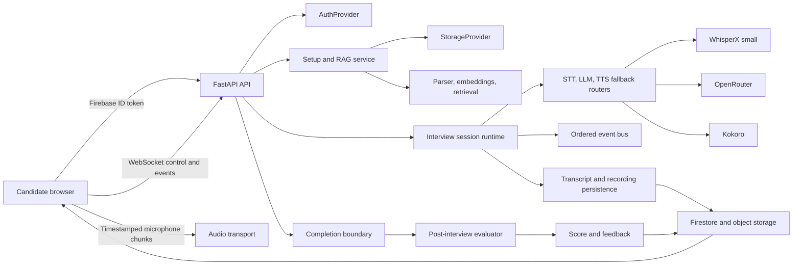
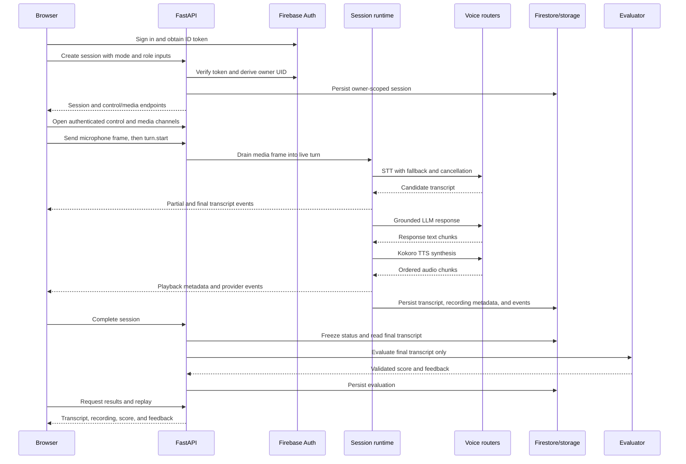
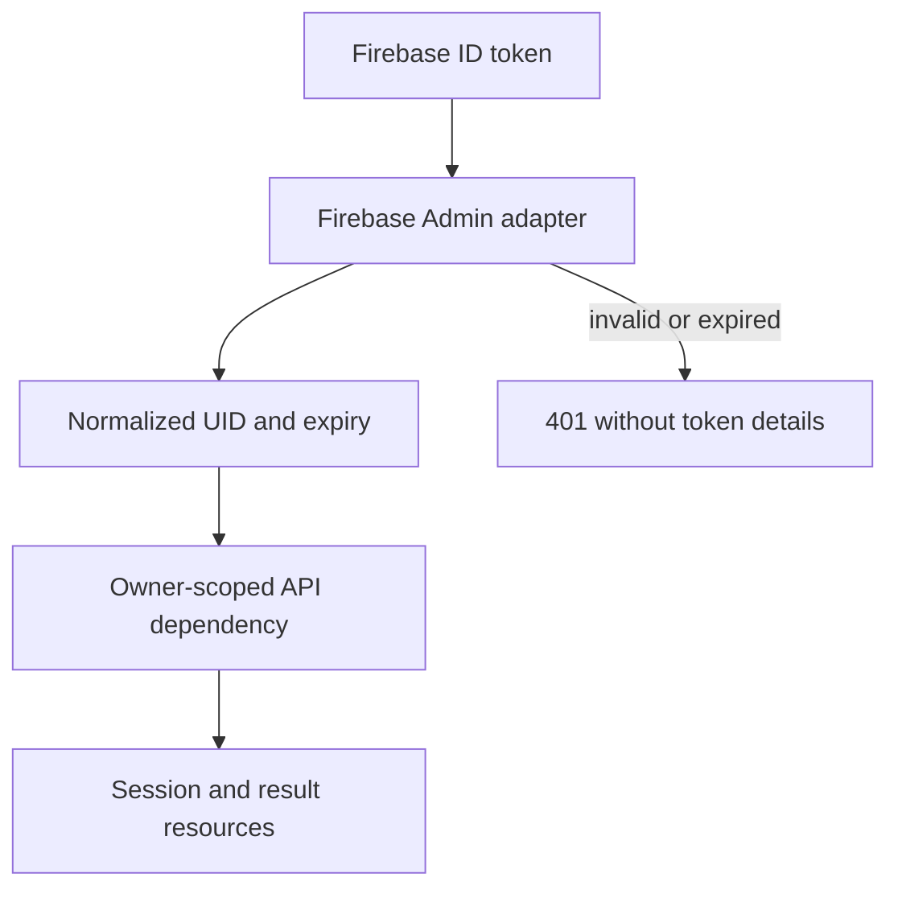
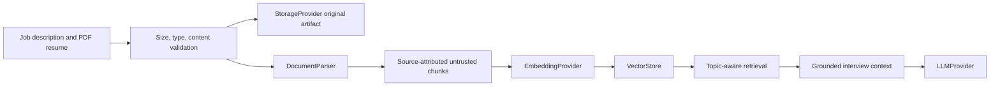
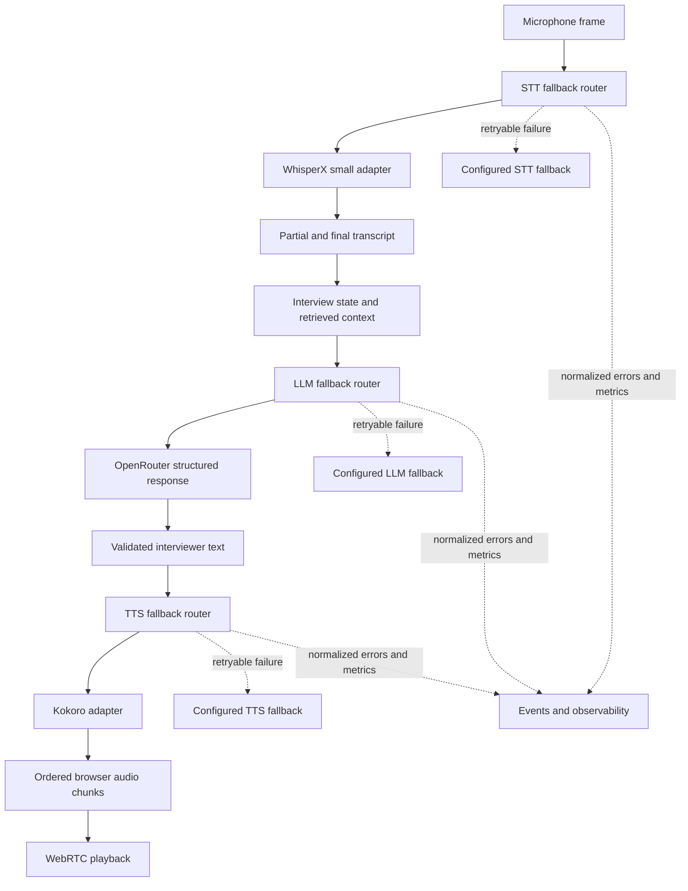
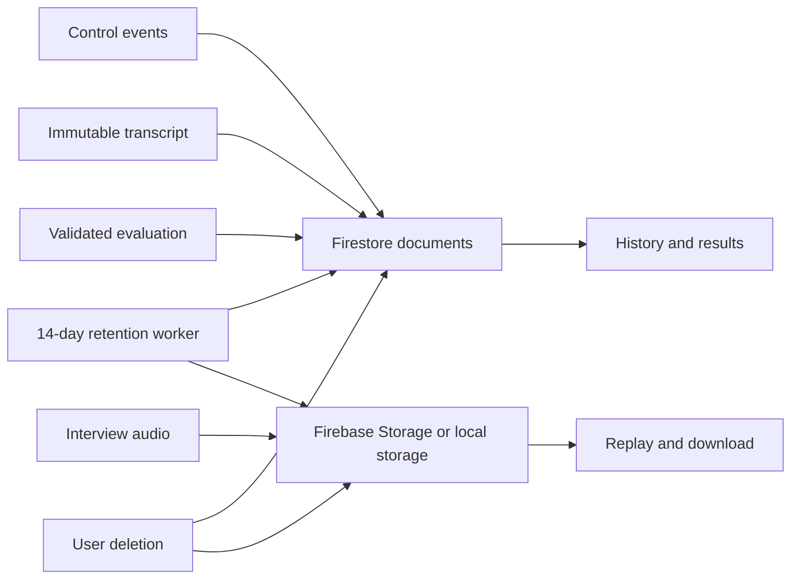
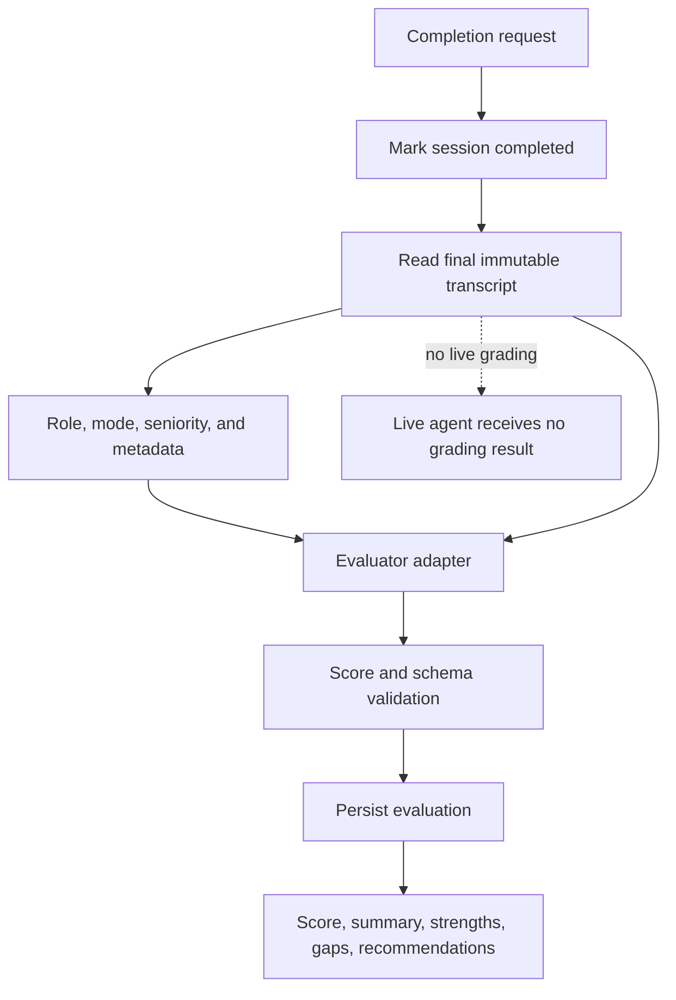

# Product Specification: AI Mock Interview Platform

## 1. Product objective

Build a browser-based, voice-native mock interview platform that lets a candidate practice realistic recruiter and technical interviews with an LLM agent. The interview is tailored to the supplied job description, optional resume, seniority, location, company context, and other relevant candidate or role information.

The platform must feel conversational and adaptive rather than playing a fixed script. It must support low-latency spoken interaction, preserve the complete interview, and provide structured post-interview feedback.

## 2. User experience

### 2.1 Interview setup

The candidate can provide:

- A text-only job description
- An optional PDF resume upload
- Interview mode: recruiter screen or technical or hiring-manager interview

The Phase 16 beta limits uploaded resume files to 10 MB. The system extracts role requirements, topics, seniority signals, company and culture signals, and useful resume facts before the interview starts. Prompt-injection and content-security guardrails must treat uploaded resume text and job-description text as untrusted data, never as system instructions.

No separate text or chat interview mode is planned. Text appears as setup input, live transcript, status, and post-interview feedback while the interview itself is voice-based.

### 2.2 Interview modes

The first release supports two modes:

- **Recruiter screen:** background, motivation, role fit, communication, logistics, compensation, availability, location, and work authorization when relevant.
- **Technical or hiring-manager interview:** technical depth, problem solving, system design or domain knowledge, project experience, behavioral signals, and role-specific follow-up questions.

The agent impersonates the appropriate recruiter, hiring manager, or technical interviewer. Persona behavior should reflect the job description and available company context without making unsupported claims about a real person or company.

### 2.3 Live conversation

During the interview, the agent must:

- Ask questions appropriate to the selected role and seniority
- Follow up on the candidate's actual answers
- Maintain a coherent interview state and topic progression
- Adapt difficulty and questioning style based on observed evidence
- Use short acknowledgements or company and culture context when appropriate
- Allow natural pauses, interruptions, corrections, and turn-taking

Substantive questions must remain dynamically grounded in the latest conversation. The system may prepare candidate topics, follow-up hypotheses, acknowledgements, or short informational responses ahead of time, but it must be able to discard them when the candidate changes direction.

### 2.4 Interview records and results

The system records:

- Downloadable interview audio
- A timestamped, speaker-labeled transcript
- Interview events and state transitions needed for replay and debugging
- Final structured evaluation and rendered feedback

After the interview, the candidate can replay the audio, inspect the transcript, and view:

- An overall score out of 100
- A concise summary
- Strengths and standout answers
- Weaknesses and missed opportunities
- Role-specific and communication feedback
- Concrete improvement recommendations
- A recruiter-style or hiring-manager-style assessment

Evaluation is performed after the interview from the final transcript and related interview metadata. The live agent must not expose a hidden grading result while the interview is in progress.

### 2.5 Account and application interface

The production browser application must provide:

- Firebase signup, login, logout, session restoration, and protected routes
- Accessible loading, empty, validation, provider-error, permission-denied, reconnect, and offline states
- Job-description entry, PDF resume upload with progress and validation, interview-mode selection, and setup confirmation
- Active interview controls for microphone permission, mute, interruption, stop, reconnect, connection status, and live transcript
- History, audio replay, transcript, evaluation, deletion, retention, and account-management views

The interface must use React and Tailwind with a small abstract design-token and component layer. API clients, state machines, transport adapters, and visual components must remain separate so the visual design can be changed without changing product behavior.

### 2.6 Browser interview contract

A production interview is not complete until a real browser can:

1. Authenticate the candidate.
2. Submit a job description and optional valid PDF resume.
3. Create and authorize an interview session.
4. Establish an authenticated WebSocket control channel and WebRTC media connection.
5. Send microphone audio to the interview pipeline and receive agent audio.
6. Display partial and final transcript events with timestamps and speaker labels.
7. Handle interruption, cancellation, reconnect, provider fallback, and microphone denial.
8. Complete the session and retrieve persisted recording, transcript, and evaluation results.

The local deterministic browser profile may use in-memory providers, but it must exercise the same API, WebSocket, WebRTC, persistence, and UI contracts. It must not be treated as evidence that configured production providers work.

### 2.7 Phase 12 implementation status

The React frontend now provides a protected, responsive application shell, deterministic local identity journey, setup validation, PDF selection and progress/error surfaces, live interview control states, history and feedback states, and a provider-neutral configured-auth seam. The local journey is verified with behavior tests and browser frames. Firebase configuration, real upload persistence, microphone/WebRTC/WebSocket media, replay, and completed evaluation retrieval remain deployment or subsequent integration work and are not claimed by local evidence.

### 2.8 Phase 13 implementation status

Phase 13 adds the authenticated browser session control loop. REST-created sessions expose owned WebSocket control and signaling boundaries with normalized envelopes, monotonic sequence cursors, replay after acknowledgement, heartbeat, cancellation, interruption, transcript/provider status events, and safe close/error handling. Browser WebRTC and microphone/playback lifecycle is represented by an injected provider-neutral media boundary; media frames never enter WebSocket payloads. The deterministic local mode uses in-memory adapters and does not prove real microphone, TURN/WebRTC networking, Firebase, or configured-provider readiness. Run `./scripts/test_phase13.sh` for marker evidence and `npm test --prefix frontend` for browser adapter tests.

### 2.9 Phase 14 implementation status

Phase 14 provides a behavior-level full-user acceptance harness in `src/interviewer_domain/e2e_acceptance.py` and `tests/test_phase14_full_user_e2e.py`. The local profile drives the real application/domain seams through setup, PDF parsing, retrieval, provider-separated voice orchestration, WebSocket control, WebRTC media buffering, interruption, reconnect, persistence, evaluation, replay, history, and deletion. It emits timestamped JSON, Markdown, and HTML evidence and reports configured STT, TTS, LLM, Firebase, storage, and WebRTC integrations as exercised or explicitly skipped. Run `./scripts/test_phase14.sh`; this remains offline evidence and does not claim absent production credentials or hosted infrastructure.

### 2.10 Phase 15 provider integration suite

Phase 15 adds explicitly selected provider integration profiles and concrete lazy transports for OpenRouter HTTP, operator-supplied Faster-Whisper models, Piper/Kokoro commands, Firebase Admin Auth, Firestore, S3-compatible storage, and configured browser/WebRTC infrastructure. The existing capability interfaces remain the application boundary, and provider wire formats, credentials, timeout/cancellation handling, redaction, and deletion behavior remain inside adapters. `scripts/test_phase15.sh` runs credential-free adapter contracts and writes redacted evidence; configured provider tests are separate and are never implied by skipped profiles. The current local environment does not claim real provider or browser readiness without configured execution evidence.

## 3. Capability-based architecture

Business logic must depend on capability interfaces, not vendors. Every production, local, test, and experimental implementation is an interchangeable provider selected through configuration and runtime routing.

Initial capabilities include:

- `LLMProvider`: streaming generation, structured generation, cancellation, token usage, and model metadata
- `STTProvider`: streaming or batch transcription, partial results, final results, timestamps, and speaker or channel metadata where available
- `TTSProvider`: low-latency synthesis, streaming audio chunks, cancellation, voice metadata, and playback format information
- `DataStore`: users, interview sessions, events, transcripts, recordings, provider measurements, and evaluations
- `AuthProvider`: sign-in, session validation, and user identity claims
- `DocumentParser`: resume and job-description text extraction and normalization
- `EmbeddingProvider`: document embedding and semantic retrieval
- `VectorStore`: resume and job-description chunk storage and retrieval
- `AudioTransport`: browser media and server-side audio stream abstractions
- `EventBus`: asynchronous domain events, status updates, retries, and optional fan-out
- `StorageProvider`: audio, document, transcript, evaluation, and export file storage
- `ResearchProvider`: optional external company or culture research, with source metadata and explicit trust boundaries
- `ObservabilityProvider`: latency, quality, errors, and provider comparison metrics

Interfaces should define normalized domain payloads, cancellation behavior, timeout behavior, errors, health checks, and capability discovery. Provider-specific request and response formats must remain inside provider adapters.

### 3.1 Provider experimentation and routing

Each capability can have multiple implementations for local, hosted, open-source, and commercial options. Examples include:

- Local STT: Faster-Whisper or Whisper.cpp
- Hosted STT: Groq Whisper
- Local TTS: Kokoro or Piper in CPU-capable containers
- Hosted or remote TTS: any provider that satisfies `TTSProvider`
- Hosted LLM: OpenRouter models, initially including a fast live-interview model and a stronger asynchronous evaluator
- Local or self-hosted LLM: added when hardware and latency permit
- Datastore: Firestore and a local test implementation behind `DataStore`
- Storage: local Docker volume or filesystem implementation, with cloud or S3-compatible implementations added behind `StorageProvider`
- Research: optional model-supported web search or a dedicated research adapter behind `ResearchProvider`

These are candidate implementations, not permanent product commitments. The platform must support A/B testing and controlled comparison using common metrics such as first-byte latency, end-to-end turn latency, quality, interruption behavior, cost, failure rate, and resource consumption. Production selection should be based on measured results rather than vendor assumptions.

## 4. Communication and transport model

The browser and backend use separate transports for separate concerns:

- **WebRTC:** real-time microphone capture and agent audio playback, using media tracks and low-latency media delivery where supported
- **WebSocket:** bidirectional interview control and state communication, including session events, partial transcripts, agent response state, playback commands, interruptions, errors, and provider telemetry needed by the active client
- **HTTP REST API:** authentication-related bootstrap, interview creation, document upload, session history, transcript retrieval, recording download, evaluation retrieval, provider configuration, and administrative operations
- **Event bus or Pub/Sub:** optional backend-only asynchronous communication for transcript processing, recording finalization, evaluation jobs, analytics, retries, and fan-out notifications. The frontend should normally receive user-visible updates through the WebSocket session channel rather than connecting directly to infrastructure Pub/Sub.

A session event model must provide ordering, correlation IDs, idempotency, reconnect behavior, cancellation, and a clear distinction between partial and final results. WebRTC signaling may use the WebSocket or REST layer, but media must not be tunneled through WebSockets unless a specific fallback requires it.

## 5. Interview agent architecture

The live agent is composed of explicit layers:

1. **Context builder:** normalizes the job description, resume facts, role metadata, and interview mode.
2. **Resume and job-description RAG:** retrieves only context relevant to the current topic instead of sending the entire resume on every turn.
3. **Interview state machine:** tracks persona, topics, evidence, unanswered threads, time budget, turn ownership, and completion conditions.
4. **Question planner:** selects the next topic and prepares follow-up hypotheses without locking the session to a pre-generated script.
5. **Live response generator:** produces the substantive interviewer response through `LLMProvider`.
6. **Secondary response layer:** produces short acknowledgements, natural fillers, or factual company and culture explanations grounded in allowed job-description context. This layer may use a smaller, faster model or deterministic templates. Its output is optional and may be spoken, skipped, or cancelled depending on readiness and relevance.
7. **Audio scheduler:** coordinates text streaming, TTS chunking, playback, interruption, and cancellation.

The system may precompute a small set of likely follow-up topics or secondary responses while the candidate is speaking. It must never blindly speak a stale question after an unexpected candidate answer.

## 6. Resume, job-description RAG, and external context

The ingestion pipeline should:

- Parse PDF resumes and pasted job-description text
- Normalize sections and metadata
- Chunk content with source references
- Store embeddings through `EmbeddingProvider` and `VectorStore`
- Retrieve relevant evidence for the current interview topic
- Preserve source attribution for evaluation and debugging
- Apply privacy, retention, and deletion rules

Company information, culture, and policy context should be extracted from the job description and resume where relevant. If the selected LLM or a configured `ResearchProvider` supports web research, it may retrieve additional public metadata. External facts must retain source metadata, remain clearly separated from user-provided content, and never override explicit job-description evidence without an auditable reason.

The live prompt should contain the smallest useful retrieved context. Resume content, job-description content, and external research must remain distinguishable so the agent does not present candidate claims as employer requirements or unverified research as fact.

## 7. Evaluation rubric

Post-interview evaluation must return structured data before generating prose. The rubric is mode-specific and configurable. Initial dimensions may include:

- Communication and clarity
- Role relevance and motivation
- Technical depth or domain understanding
- Evidence of impact and ownership
- Problem solving and reasoning
- Behavioral signals and collaboration
- Interview readiness and response quality

Each dimension has a documented weight, evidence references, score, confidence, and explanation. The weighted result produces the overall score out of 100. Recruiter and technical interviews use different weights and criteria, and the rubric must be versioned with the evaluation.

## 8. Security, privacy, and reliability requirements

The design must support:

- Authenticated access to a user's sessions and files
- A default retention period of 14 days for interview data
- User deletion of the complete interview dataset, including resume, job description, transcript, recording, feedback, derived embeddings, and external-context cache entries
- Encryption in transit and at rest through the selected infrastructure
- Redaction or restricted handling of sensitive resume information
- Provider-specific data-sharing controls
- Rate limits and upload validation, including the Phase 16 10 MB PDF limit
- Prompt-injection defenses that isolate untrusted document and research content from system and developer instructions
- Content validation and output constraints for secondary responses and external research
- Recovery from provider timeouts, disconnects, and partial audio failures
- Auditable session, provider, research-source, and evaluation versions

The system must run locally through Docker with CPU-only development assumptions, including approximately 4 GB RAM and 250 GB storage. Deployment boundaries must support separate frontend, API, audio, and worker services, with local storage first and remote providers such as S3-compatible storage, Vercel, or Railway added through interfaces and deployment adapters.

### 8.1 Configuration and secret management

The repository must provide a committed `.env.example` and typed configuration documentation for all runtime settings, including:

- Firebase project, web configuration, authentication, and Firestore settings
- Storage backend and bucket or filesystem settings
- STT, TTS, interviewer LLM, candidate-test LLM, and fallback provider settings
- WebSocket, WebRTC, CORS, frontend API origin, rate limits, and retention
- Logging, metrics, tracing, and feature flags

Real secrets must never be committed, bundled into the frontend, printed in diagnostics, or required by the default offline test suite. The application must have an explicit deterministic local profile and an explicit production profile. Production startup must fail safely when required provider configuration is missing rather than silently using mock providers.

### 8.2 Verification tiers

The project must maintain distinct verification tiers:

1. **Unit and contract tests:** call real domain and adapter methods with deterministic fixtures and assert observable behavior. Source inspection and static-string-only tests are forbidden.
2. **Offline application tests:** exercise the real API, persistence, transport, and live-voice composition without credentials or network access.
3. **Browser E2E tests:** use a real browser to authenticate, submit setup data, upload a local PDF, establish WebSocket and WebRTC connections, perform a voice turn, reconnect or interrupt, complete, and inspect results.
4. **Provider integration tests:** run against explicitly configured Firebase, storage, STT, TTS, LLM, and WebRTC services only when tagged and enabled by environment configuration.
5. **Release and live-demo tests:** run the production-shaped Docker deployment with selected providers, HTTPS, monitoring, retention, deletion, and rollback procedures.

The offline tiers must never claim provider or live-rehearsal readiness. Provider integration and agent-to-agent rehearsal evidence must be reported separately.

### 8.3 CI and coverage gates

CI must execute, not simulate, the required checks on every pull request:

- Backend formatting, linting, type checking, unit tests, API tests, and offline E2E tests
- Frontend formatting, linting, type checking, unit/component tests, and production build
- Browser E2E smoke tests against a deterministic local deployment
- Separate opt-in provider integration jobs when required secrets and configuration are available
- Coverage reports and enforced thresholds for domain, API, frontend, and browser-critical code

Missing tools, skipped commands, coverage regressions, failed builds, and missing required artifacts must fail the relevant gate. Generated coverage, dependency, and browser artifacts must not be committed to source control.

Phase 10 establishes the credential-free offline portion of this policy: pinned Python and Node development tools, strict local scripts, an 80% aggregate backend coverage floor, frontend seam coverage, and a real GitHub Actions job with report uploads. Browser, provider, and per-surface release thresholds remain later gates and must not be inferred from this offline result.

### 8.4 Phase 11 runtime readiness boundary

Phase 11 provides typed environment configuration with explicit `local` and `production` profiles. The local profile uses deterministic in-memory capabilities and requires no credentials or network. The production profile must fail before serving traffic when required Firebase, storage, or provider configuration is absent. Startup diagnostics expose only profile, provider names, configuration-presence flags, limits, and normalized health states. Provider-shaped adapters are exercised through injected seams; deterministic evidence must not be described as real provider or browser readiness.

## 9. Delivery phases

1. **Domain and capability foundation:** define normalized models, interfaces, errors, provider routing, configuration, and local test providers.
2. **Voice session engine:** build the voice-first interview state machine, persona rules, topic planning, cancellation, and session events.
3. **Document intelligence:** implement job-description parsing, PDF resume parsing, RAG retrieval, prompt-injection defenses, and privacy boundaries.
4. **Provider benchmark harness:** implement local and hosted STT, TTS, and LLM adapters plus repeatable A/B measurements.
5. **Browser transport:** implement WebRTC media, WebSocket events, REST APIs, reconnect behavior, and optional backend Pub/Sub workflows.
6. **Live voice loop:** connect streaming STT, live LLM generation, secondary responses, TTS scheduling, interruption, and recording.
7. **Persistence and identity:** integrate Firebase Authentication, Firestore, `StorageProvider`, retention, deletion, and provider-independent data access.
8. **Post-interview analytics:** compile final transcripts, run versioned rubric evaluation, and render feedback.
9. **Initial production boundary:** add a FastAPI composition root, local deterministic frontend shell, Docker boundary, and operational documentation. This phase is not browser or provider readiness.
10. **Test integrity and CI:** audit behavior-level tests, install reproducible tooling, execute real CI gates, and publish reports.
11. **Runtime configuration and providers:** add `.env.example`, typed settings, production startup validation, selected STT/TTS/LLM providers, and provider health.
12. **Production frontend and identity:** implement the complete Tailwind UI, Firebase signup/login, setup, protected routes, history, replay, transcript, results, deletion, and account states.
13. **Browser voice integration:** implement authenticated WebSocket and WebRTC media behavior and connect the browser to the live voice loop.
14. **Full user E2E acceptance:** validate login through completed evaluated interview using a real browser and separate interviewer and candidate simulation providers.
15. **Provider integration suite:** add explicitly enabled tests against configured external providers and infrastructure.
16. **Live Beta Enablement:** compose the explicit beta provider set into a real browser-to-provider vertical slice and validate beta acceptance criteria.

The project is not production-ready for a live demo until phases 10 through 16 have passed their required gates. All features must follow the repository's SDD workflow: feature specification, implementation plan, marker contract, implementation, unit tests, end-to-end evidence, documentation, and landmine recording where applicable.

## 10. Live Beta Enablement contract

Phase 16 is the authoritative implementation program for reaching a real beta. The previous deterministic local phases establish contracts only. They cannot satisfy the requirements in this section.

### 10.1 Fixed first-beta provider set

| Capability | Required first-beta implementation | Abstract boundary |
|---|---|---|
| Auth | Firebase Web Auth email/password and Google Sign-In with Firebase Admin verification | `AuthProvider` |
| Datastore | EU Firestore | `DataStore` |
| Storage | Firebase Storage bucket `gs://the-interviewer-c3a01.firebasestorage.app`, with local/NFS test storage | `StorageProvider` |
| Live LLM | OpenRouter using `LLM_API_KEY` and configured `LLM_MODEL` | `LLMProvider` |
| STT | WhisperX using the `small` or `small.en` model on CPU | `STTProvider` |
| TTS | Kokoro 0.9.4 English, `af_bella` or `af_sky`, 24 kHz mono PCM | `TTSProvider` |
| Voice | Programmatic timestamped audio buffers for the beta rehearsal; browser WebRTC remains a later transport | `AudioTransport` |
| Evaluation | GPT-5.6 Luna Pro through OpenRouter after completion | `Evaluator` |
| Workers | CPU-only bounded workers in one initial Docker container | worker boundary |
| Retention | Resume 14 days, combined audio 7 days, audit/access records 30 days | retention policy |

These choices supersede earlier candidate-provider lists for the first beta. Other providers may be added only behind the same boundaries after the beta path is working.

### 10.1.1 Authoritative implementation decisions

These decisions are final for Phase 16 and must not be reopened by delegated implementation agents:

- Use `.env` as the configured source for the live beta runtime. Never print or commit its values.
- Use `FIREBASE_CREDENTIALS_PATH` for backend Firebase Admin credentials when configured; Firebase Web Auth settings are separate browser configuration.
- Use `LLM_API_KEY`, not `OPENROUTER_API_KEY`, for the OpenRouter credential.
- Do not require `STT_MODEL_PATH`, `TTS_MODEL_PATH`, or `TTS_COMMAND`; WhisperX and Kokoro receive provider model/language configuration through `STT_MODEL`, `TTS_MODEL`, and language settings.
- Use WhisperX `small` on CPU by default, Kokoro English with random supported voice selection, and OpenRouter with the configured model.
- Use Firebase Storage as the beta storage provider with bucket `gs://the-interviewer-c3a01.firebasestorage.app`; retain local/NFS storage for deterministic and local integration checks. Ignore FTP for Phase 16. S3 and GCS are out of scope.
- The Phase 16 live rehearsal is programmatic, not browser-dependent: an Interviewer Agent and an Interviewee Agent exchange timestamped audio buffers through the backend flow. Browser WebRTC, secure WebSocket signaling, and managed STUN/TURN remain implementation requirements for the later browser transport phase, not a Phase 16 beta-evidence gate.
- Use one Docker container for the initial beta benchmark.
- Live provider execution is mandatory evidence. Phase 16 uses agent-to-agent programmatic E2E evidence instead of browser execution. Offline tests are contract protection only.

### 10.2 Required source structure

The source tree must keep abstractions, implementations, and domain behavior separate:

```text
src/interviewer_domain/
  capabilities/              Protocols, normalized DTOs, provider errors
  adapters/                  Firebase, Firestore, storage, OpenRouter, STT, TTS, WebRTC adapters
  providers/in_memory/       Deterministic local implementations
  services/                  Composition, retention, upload, interview, evaluation services
  models/                    Domain entities and value objects
  composition/               Local and production dependency graphs
```

Domain services may depend on `capabilities` and `models`, but must never import a vendor SDK. Adapters own SDK imports, wire schemas, credential handling, retries, timeouts, redaction, metadata, and provider error normalization. Compatibility re-exports may remain temporarily during migration but new code must use the package boundaries.

### 10.3 Live service schemas and flow

The live request flow is: Firebase browser login produces an ID token; FastAPI verifies it and derives the Firebase UID; setup validates the job description and 10 MB PDF limit; storage persists the original resume; parsing and retrieval create source-linked context; Firestore creates an owner-scoped session; WebSocket carries ordered control and transcript/status events; timestamped browser microphone chunks reach the selected audio transport; WhisperX small emits partial and final timestamped segments; the interview state machine builds grounded context; OpenRouter emits a validated structured response; Kokoro schedules browser-compatible audio; transcript/events/recording are persisted; completion freezes the transcript; the evaluator produces validated score and feedback; history/replay expose stored artifacts; deletion removes every raw and derived artifact.

The normalized contracts are:

- **Identity:** user ID, optional email, provider, issued-at, expiry, and assurance. Raw tokens never enter domain services.
- **Setup:** job description, optional resume upload ID, recruiter/technical mode, optional seniority and location metadata.
- **Session:** ID, owner, mode, lifecycle status, provider set, creation time, and expiry.
- **Event:** schema version, session ID, sequence, correlation ID, timestamp, type, and metadata payload. Audio bytes never enter WebSocket events.
- **Transcript:** segment ID, speaker, text, start/end milliseconds, final flag, confidence, and source.
- **Interviewer response:** spoken text, question type, topic, evidence request, completion flag, and bounded state update.
- **Evaluation:** score 0 through 100, summary, strengths, weaknesses, missed opportunities, recommendations, role assessment, rubric version, model metadata, and evidence references.

### 10.4 Architecture and provider flows

The platform is organized as a browser media plane, an authenticated control plane, and provider-independent domain services. Concrete providers are selected by the composition root and are never called directly by the browser or interview state machine.

### 10.4.1 High-level platform flow



### 10.4.2 Complete browser interview sequence



### 10.4.3 Provider and implementation flows

#### Authentication and owner isolation



#### Job description, resume, and RAG context



#### Live STT, LLM, and TTS provider chains



#### Persistence, replay, retention, and deletion



#### Post-interview evaluation



These diagrams describe the beta execution boundary. Deterministic local providers exercise the same contracts, but do not prove configured external providers or browser infrastructure are ready.

## 10.4 Beta acceptance criteria

- A clean CPU-only deployment starts using the documented production composition and no in-memory provider.
- Firebase signup, login, refresh, logout, protected routes, server token verification, and owner isolation work in a real browser.
- Firestore persists sessions, setup, events, final transcripts, evaluations, retention, and deletion state.
- Firebase Storage and local filesystem adapters pass upload, download, replay, retention, and deletion tests.
- A real PDF and job description reach parsing, source-linked retrieval, and the live prompt context.
- Timestamped agent audio buffers reach WhisperX small and produce partial and final transcript events.
- OpenRouter produces validated structured streaming interviewer responses with cancellation, timeout, rate-limit, fallback, cost, and model metadata.
- Kokoro produces browser-playable audio with sequencing, interruption, cancellation, and measured first-audio latency.
- The Interviewer Agent and Interviewee Agent complete recruiter and technical interviews through the backend using the fixed live provider set.
- Browser audio transport, external browser networking, WebRTC, STUN, and TURN are deferred from Phase 16 acceptance.
- Candidate/interviewer audio, immutable transcript, events, and evaluation persist and replay.
- The LLM evaluator runs only after completion and stores bounded feedback.
- User deletion removes original, derived, cached, transcript, recording, evaluation, and provider-created test artifacts.
- Negative cases cover invalid auth, owner mismatch, malformed or scanned/encrypted PDF/audio, provider outage, timeout, cancellation, quota, storage failure, and deletion failure.
- Evidence reports exercised, skipped, or failed per provider; skipped or deterministic results cannot satisfy beta acceptance.

### 10.5 Verification boundary

The project has three explicit evidence levels:

1. Contract readiness: interfaces and deterministic tests.
2. Provider readiness: real configured provider operation through the adapter.
3. Beta readiness: a real browser user completes the entire flow and receives durable results.

Only level 3 can close Live Beta Enablement.
